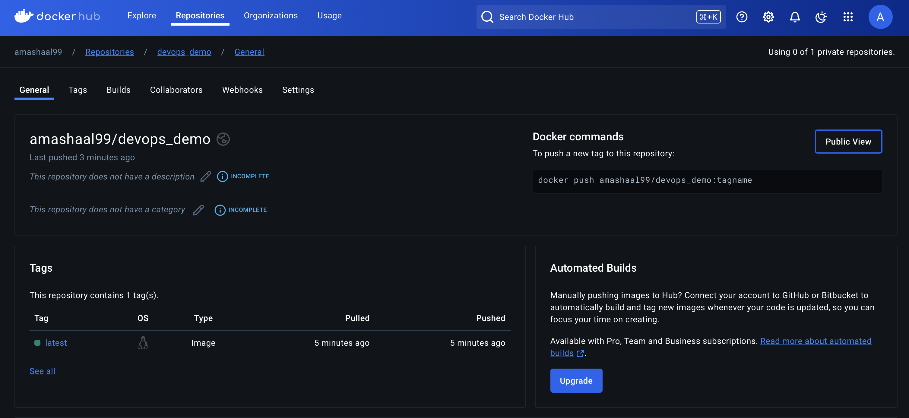

# DevOps CI/CD Workflow: Automated Docker Image Build and Push

This project demonstrates a CI/CD pipeline using GitHub Actions to automate the testing, building, and deployment of a Docker image to Docker Hub. The workflow is structured to ensure that the test job successfully completes before triggering the build and deployment stages.

## Overview

The CI/CD workflow is configured as follows:
1. **Testing Stage**: Runs automated tests to validate the program’s functionality.
2. **Build Stage**: Creates a Docker image based on the code in the repository.
3. **Deployment Stage**: Pushes the successfully built image to my Docker Hub repository.

### Key Features
- **Automated Testing**: Ensures code reliability by executing tests prior to building the Docker image.
- **Conditional Workflow Execution**: Uses the "needs" dependency in GitHub Actions to link stages, ensuring that each stage only proceeds if the previous one completes successfully.
- **Docker Hub Integration**: The workflow is set to push the Docker image to Docker Hub upon a successful build, making it available for deployment.

### Docker Hub Image

